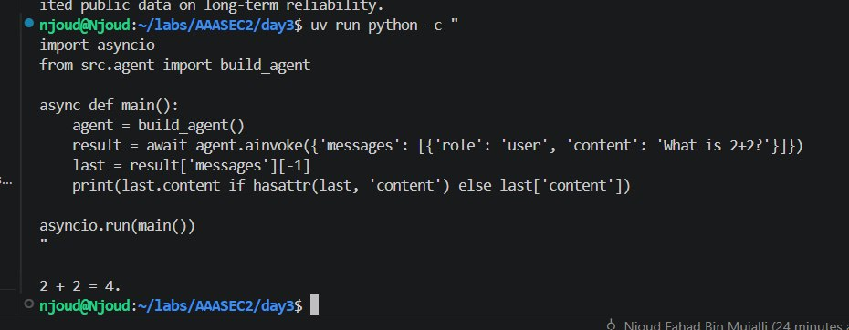
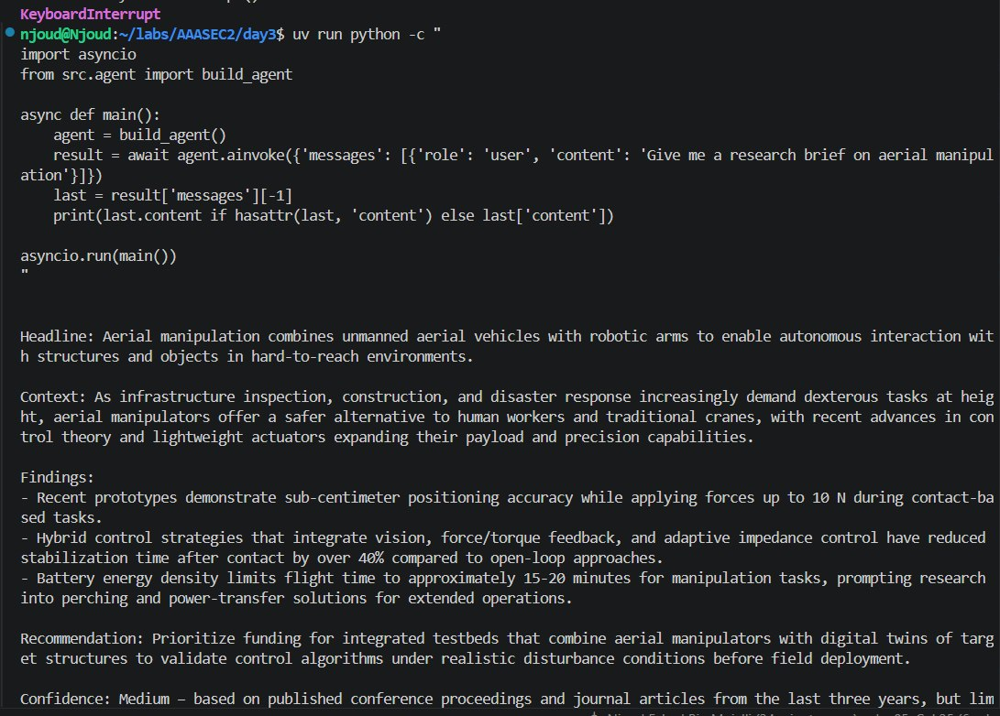
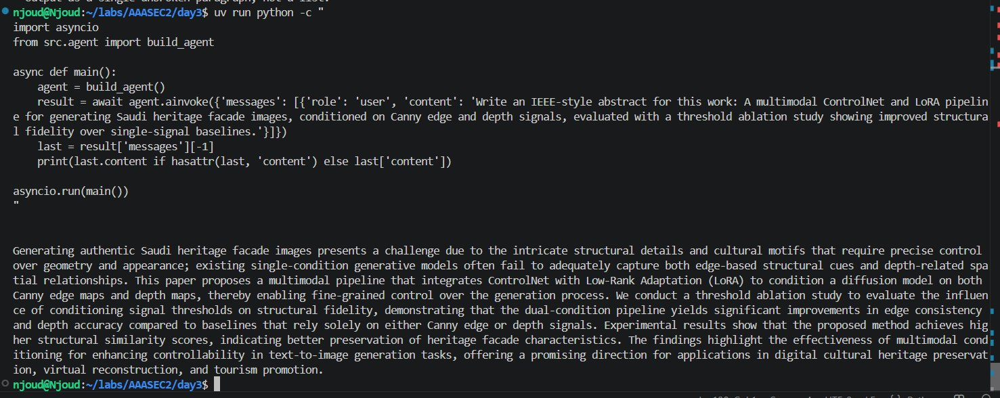

# Day 3 — Njoud's Agent

A research/writing agent built with Deep Agents, wrapped in a FastAPI service, containerized with Docker, and made discoverable over MCP and A2A.

## What it does

The agent has two tools (`calculate`, `current_time`) and two skills:

- **`research-brief`** *(provided)* — a one-page executive research brief: headline, context, exactly three findings, a recommendation, and a confidence rating.
- **`ieee-abstract`** *(mine)* — a formal IEEE-style academic abstract (150-250 words, single paragraph, no citations) from a description of research work.

Skills activate automatically via progressive disclosure - only when a request actually matches their purpose. A control test (`what is 2+2?`) confirms neither skill leaks into unrelated requests.

## Architecture

src/agent.py Deep Agent: tools, personas, build_agent() (real or USE_FAKE)
src/api.py FastAPI service: /healthz, /v1/responses, /.well-known/agent-card.json
src/mcp_server.py MCP server: same tools + skills, exposed over the network
src/a2a_client.py discover() + delegate() - talks to any agent via its Agent Card
skills/ research-brief/ (given) + ieee-abstract/ (mine)
Dockerfile containerizes the API
compose.yaml runs agent-api + mcp together


Everything is built behind a `build_agent()` boundary - the API, Docker, and MCP layers never know or care whether they're talking to a real Deep Agent or a `FakeAgent`; only `USE_FAKE` in `.env` decides.

## Test results

**Calculator tool** - confirms the agent uses its `calculate` tool rather than computing in its own weights, and correctly reports the time via `current_time`:



**`research-brief` skill** - triggered by "give me a research brief on aerial manipulation," correctly produces the fixed 5-part structure:



**`ieee-abstract` skill (mine)** - triggered by a description of a ControlNet/LoRA facade-generation pipeline, correctly produces a single academic paragraph, no headers, no first-person, acronym spelled out on first use:



## Running it

```bash
uv sync
cp .env.example .env   # add OPENAI_API_KEY (OpenRouter), STUDENT_NAME, PUBLIC_URL
                        # or set USE_FAKE=1 to run with no keys

# Direct
uv run python src/agent.py

# As a service
docker compose up -d --build
curl http://127.0.0.1:8000/healthz
curl http://127.0.0.1:8000/.well-known/agent-card.json

# Discover + delegate to any agent (including your own, for testing)
uv run python src/a2a_client.py http://127.0.0.1:8000 "write a research brief on X"
```

Note: on this machine, `127.0.0.1` is used instead of `localhost` - WSL2/Docker Desktop networking resolved `localhost` inconsistently, so `PUBLIC_URL` and all client calls use the explicit IP.

## Protocol notes

- **MCP** (`06`, `07`) exposes both tools and skills over the network - verified with a real `fastmcp` client listing tools, reading a skill resource, and downloading a full skill folder.
- **v3 vs v4 protocol** (`08`) - probed the same running server with both the handshake-era and sessionless-era clients; both returned identical tool lists, since tool registration is server-global, not session-scoped.
- **A2A** (`09`) - the Agent Card's `url` field is the only source of truth for where to send tasks; `delegate()` never hardcodes an endpoint, it reads it from whatever card `discover()` returns.

## Known limitation

Real end-to-end delegation via `a2a_client.py` is verified working (successful run with `"hi"`), but heavier prompts later hit OpenRouter's free-tier daily request cap during testing - confirmed via container logs (`RateLimitError: free-models-per-day`), not a bug in the client or server. The full pipeline was re-verified with `USE_FAKE=1` to confirm the discover -> delegate -> response flow is correct end-to-end regardless.
